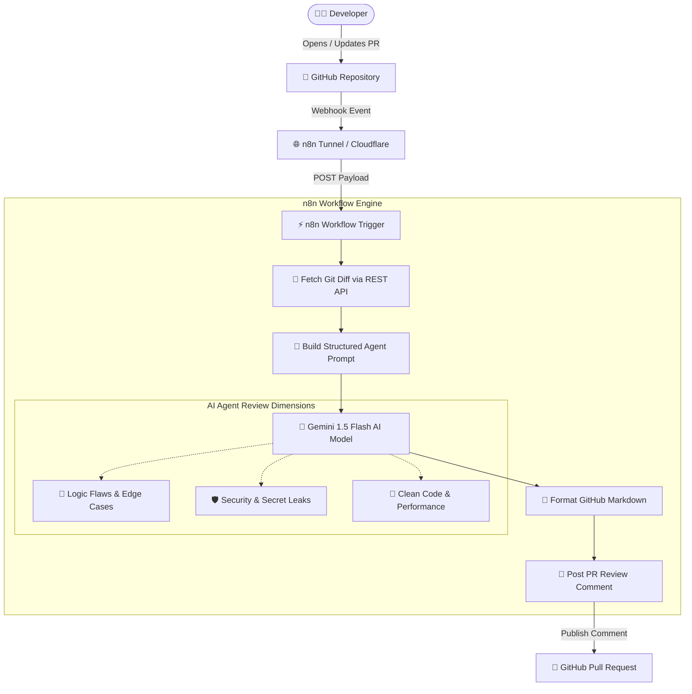

# 🤖 AI GitHub Code Review Agent

> An automated, agentic code review system built with **n8n**, **Google Gemini AI**, and **GitHub Webhooks** — **100% Free of Cost ($0)**.

---

## 🌟 Overview

The **AI GitHub Code Review Agent** automatically monitors your GitHub repository for Pull Requests, fetches the raw git diff, analyzes the code across security, bugs, and best practices using LLMs, and posts structured, actionable review comments directly on GitHub.



---

## 💰 100% Free ($0) Stack

- **Orchestration**: Self-hosted [n8n](https://n8n.io/) Community Edition (runs on local laptop or Docker).
- **AI Brain**: [Google Gemini 1.5 Flash](https://aistudio.google.com/) via Google AI Studio Free Tier (15 RPM, zero cost).
- **Tunneling**: `n8n start --tunnel` (Built-in free HTTPS tunnel for GitHub Webhooks).
- **VCS & API**: GitHub Free Tier (Webhooks + Personal Access Token).

---

## 🚀 Quick Setup Guide

### 1. Get Your API Keys (Free)
1. **GitHub Personal Access Token (Classic)**:
   - Go to GitHub **Settings** → **Developer Settings** → **Personal Access Tokens** → **Tokens (classic)**.
   - Click **Generate new token (classic)**.
   - Select the `repo` scope and copy the generated token (`ghp_...`).
2. **Google Gemini API Key**:
   - Go to [Google AI Studio](https://aistudio.google.com/).
   - Click **Get API key** → **Create API key**. Copy your key.

---

### 2. Run n8n (Locally with Tunnel)

Run n8n in your terminal with the built-in tunnel:

```bash
# Set environment variables
export GITHUB_PAT="ghp_your_copied_github_token"
export GEMINI_API_KEY="AIzaSy_your_gemini_api_key"

# Start n8n with public tunnel
npx n8n start --tunnel
```

Open [http://localhost:5678](http://localhost:5678) in your browser.

---

### 3. Import Workflow into n8n

1. In n8n, click **"Add Workflow"** → Top-right three dots `...` → **"Import from File"**.
2. Select [`n8n-workflow.json`](./n8n-workflow.json).
3. If not using environment variables, edit the **Fetch PR Git Diff**, **Gemini AI Code Reviewer**, and **Post Comment** nodes with your tokens.
4. Toggle the workflow to **Active**.

---

### 4. Configure GitHub Webhook

1. In your GitHub repository, go to **Settings** → **Webhooks** → **Add webhook**.
2. **Payload URL**: Paste your n8n Production Webhook URL (e.g., `https://xxxx.hooks.n8n.cloud/webhook/github-pr-review`).
3. **Content type**: `application/json`.
4. **Which events**: Select *"Let me select individual events"* → Check **Pull requests**.
5. Click **Add webhook**.

---

## 🧪 Workshop Demo Script

1. **Create a Test Branch**:
   ```bash
   git checkout -b test/vulnerable-auth
   ```
2. **Commit sample file**:
   ```bash
   git add samples/vulnerable-auth.js
   git commit -m "feat: add authentication controller"
   git push origin test/vulnerable-auth
   ```
3. **Open Pull Request** on GitHub into `main`.
4. **Watch the Magic**: Within seconds, the AI Agent reviews the PR and comments on security risks (SQL injection, hardcoded JWT secret) and code quality!

---

## 📁 Repository Structure

```
├── n8n-workflow.json        # Ready-to-import n8n workflow
├── samples/
│   └── vulnerable-auth.js   # Demo sample code with deliberate bugs & security issues
├── test-local-review.js     # Standalone CLI runner to test Gemini reviews locally
├── .env.example             # Environment variables template
└── README.md                # Project documentation
```

---

## 📄 License
MIT
