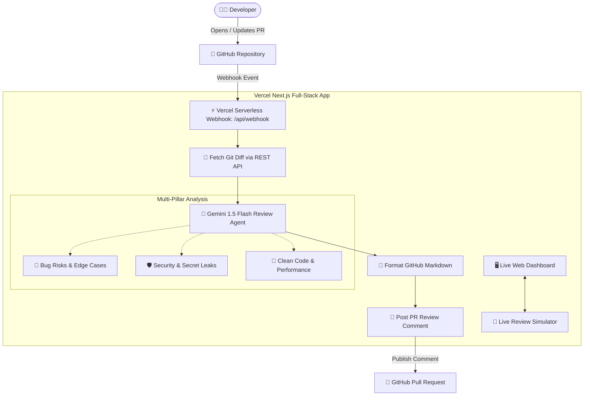

# 🤖 AI GitHub Code Review Agent

> An autonomous, full-stack AI Code Review Agent built with **Next.js**, **Google Gemini 1.5 Flash**, and **Vercel Serverless Webhooks** — **100% Free of Cost ($0)**.

---

## 🌟 Overview

The **AI GitHub Code Review Agent** automatically monitors your GitHub repository for Pull Requests, fetches the raw git diff, analyzes the code across security, bugs, and best practices using LLMs, and posts structured, actionable review comments directly on GitHub.



---

## 💰 100% Free ($0) Tech Stack

| Component | Technology | Free Tier Details |
| :--- | :--- | :--- |
| **Framework** | Next.js 14+ (App Router) | Open-source React Framework |
| **Hosting** | Vercel Serverless Functions | Free 24/7 HTTPS domain & serverless executions |
| **AI LLM Engine** | Google Gemini 1.5 Flash | Free via [Google AI Studio](https://aistudio.google.com/) (15 RPM) |
| **Git & Webhooks** | GitHub REST API | Free public & private repo webhooks |

---

## 🚀 Quick Setup Guide

### 1. Clone & Install Dependencies

```bash
git clone https://github.com/gowthamgsakthivel/ai-github-codereview-agent.git
cd ai-github-codereview-agent
npm install
```

---

### 2. Configure Environment Variables

Create a `.env` file in the root directory (copy from `.env.example`):

```env
# 1. GitHub Personal Access Token (Classic with 'repo' scope)
# Generate at: https://github.com/settings/tokens
GITHUB_PAT=ghp_your_github_token_here

# 2. Free Google Gemini API Key
# Generate at: https://aistudio.google.com/
GEMINI_API_KEY=AIzaSy_your_gemini_key_here

# 3. Target GitHub Repository
GITHUB_REPO=gowthamgsakthivel/ai-github-codereview-agent
```

---

### 3. Run Locally

```bash
npm run dev
```

Open [http://localhost:3000](http://localhost:3000) in your browser to view the **Live Review Simulator** and test AI audits immediately!

---

## ☁️ 1-Click Deployment to Vercel (Free 24/7 Webhook)

Deploying to Vercel gives you a permanent, public HTTPS webhook address (e.g., `https://ai-code-reviewer.vercel.app/api/webhook`) with **no tunnels needed**!

1. Push your repository to GitHub:
   ```bash
   git push -u origin main
   ```
2. Go to [Vercel](https://vercel.com) and click **"Add New Project"** → **Import** your GitHub repo.
3. In **Environment Variables**, add:
   - `GITHUB_PAT`
   - `GEMINI_API_KEY`
   - `GITHUB_REPO`
4. Click **Deploy**!

---

## 🔗 Connect GitHub Webhook

1. In your GitHub repository, go to **Settings** → **Webhooks** → **Add webhook**.
2. **Payload URL**: `https://your-vercel-domain.vercel.app/api/webhook`
3. **Content type**: `application/json`
4. **Events**: Select *"Let me select individual events"* → Check ✅ **Pull requests**.
5. Click **Add webhook**.

---

## 🧪 Workshop Demo Script

1. **Open Dashboard**: Go to your live dashboard to demonstrate the Gemini AI health check and review simulator.
2. **Create Test Branch**:
   ```bash
   git checkout -b test/auth-feature
   ```
3. **Commit vulnerable code**:
   ```bash
   git add samples/vulnerable-auth.js
   git commit -m "feat: add user login endpoint"
   git push origin test/auth-feature
   ```
4. **Open PR on GitHub**: Click **"Create pull request"**.
5. **Watch the AI Agent**: Within 5 seconds, the Gemini AI Agent reviews the PR and posts a detailed markdown report flagging SQL injection, hardcoded secrets, and missing error handling!

---

## 📄 License
MIT
